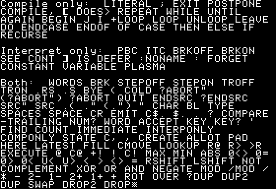

# FORTH PLASMA + PLFORTH !

PLFORTH represents a REPL and scripting language for the PLASMA environment. Or, what I did over the Holiday break.

The goals of PLFORTH are pretty straight forward:
**Interactivity** and **debugging**.

PLFORTH is a PLASMA module written in PLASMA itself. As a first class citizen of the PLASMA environment, it has instant access to all the PLASMA modules, from floating point to high-res graphics libraries and everything in between.

## Missing words in PLFORTH

There are quite a few missing word that a standard FORTH would have. Mostly due to deliberately keeping PLFORTH as minimal as possible to reduce the memory footpring and load time. Most of the missing words can be synthesized using existing PLASMA modules and some glue words. The double word have mostly been made avialable through PLASMA's 32 bit integer module, `INT32` by way of the `int32.4th` script. You can always petition to get your favorite FORTH word included in the default vocabulary. Speaking of `VOCABULARY`, PLFORTH only has one.

## PLFORTH built-in words

## PLFORTH specific words

### Words for looking at internal structures:

`SHOW xxxx`: Displays the decompiled words making up the definition of `xxxx`

`SHOWSTACK`: Displays the data stack

`SHOWRSTACK`: Displays the return stack. Note: PLFORTH uses a software defined return stack, this is not the hardware stack

### Words for tracing and single stepping execution:

`TRON`: Turn tracing on

`TROFF`: Turn tracing off (will also turn off single stepping if enabled)

`STEPON`: Turn single stepping on

`STEPOFF`: Turn single stepping off

While running code, `<CTRL-T>` will toggle tracing on and off as well

### Words for breakpoints:

`BRK`: Used inside compiled word to effect a runtime break

`BRKON xxxx`: Enable breakpoint whenever word `xxxx` is executed

`BRKOFF`: Disable the breakpoint. Note: only one breakpoint is currently supported

While running code, `<CTRL-C>` will break out and return to the interpreter.

`CONT`: Continue running from the last break point

### Words for PLASMA linkage:

`LOOKUP yyyy`: Lookup symbol `yyyy` in PLASMA symbol table and return its address

`PLASMA zzzz`: Create word `zzzz` with code address from `LOOKUP`

### Words to run a script:

`SRC`: Source filename on stack as input. Can be nested

`SRC" ssss"`: Source file `ssss` as input. Can be nested

`?ENDSRC`: End sourcing file as input if stack flag non-zero

`ENDSRC`: End sourcing file as input

### Words for compiler modes:

`PBC`: Compile into PLASMA Byte Code

`ITC`: Compile into Indirect Threaded Code

### Word for converting string to number:

`NUM?`: Convert string and length to number, returning number and valid flag

## Debugging vs Performance

PLFORTH defaults to compiling using ITC (Indirect Threaded Code). This supports a list of inspection and debugging features while developing programs and scripts. However, the compiler can easily switch to PBC (PLASMA Byte Code) to greatly improve performance, but most of the debugging tools are lost. ITC compiled words and PBC compiled words can be intermingled and call each other seemlessly. PLASMA Byte Code is a direct match to many low-level FORTH constructs.

## Hi-Res Graphics
Due to the way the Apple II implements Hi-Res graphics, a stub loader is required to reserve the pages used.

`HRFORTH`: Reserve HGR page 1 before launching PLFORTH

`HR2FORTH`: Reserve HGR pages 1 and 2 before launching PLFORTH

## Scripts

There are a few useful scripts located in the `scripts` directory. By far the most useful is `plasma.4th`

### plasma.4th useful words

`CAT`: Display files in current ProDOS directory

`CAT" pppp"`: Display files in `pppp` ProDOS directory

`PFX" pppp"`: Set current ProDOS prefix to `pppp`

`PFX.`: Display current ProDOS prefix

`EDIT" ssss"`: Edit file `ssss`

## Caveats

This is definitely a Work-In-Progress. There are still a few places where I'm unsure about the proper implementation of some words, especially the more esoteric compiler constructs. It also looks suspiciously like an early '80s wordset, as that is what I'm most familiar with.

## Links

Here is a (worse than usual) video running through some examples: https://youtu.be/picPyXAk77I?si=Td2En5Z3oxVTzh0z

A pre-configures ProDOS floppy image barely able to run PLFORTH is available here: https://github.com/dschmenk/PLASMA/blob/master/images/apple/PLFORTH.PO
